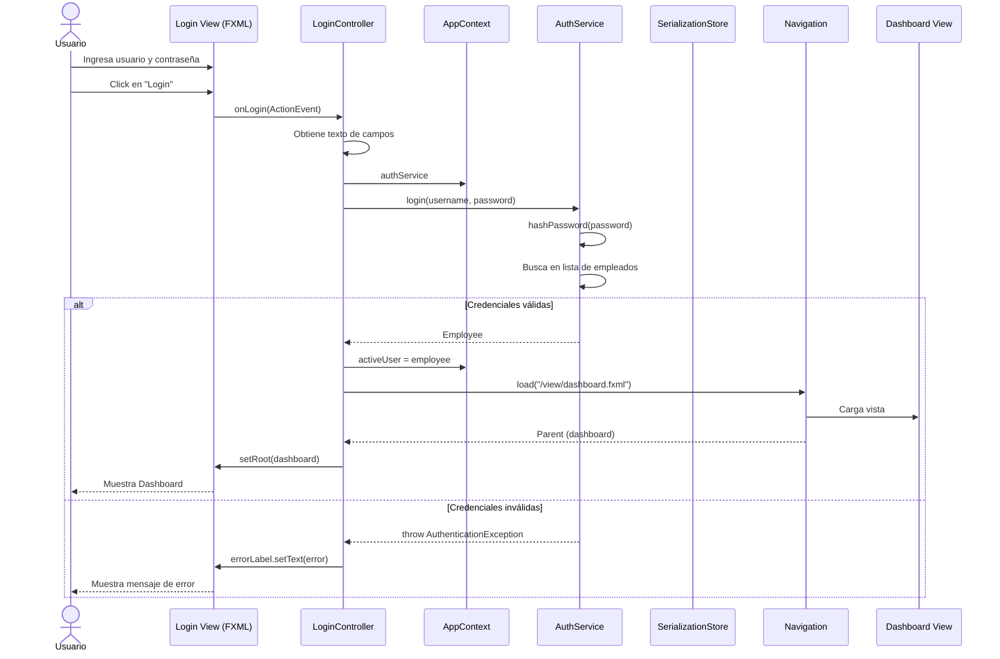
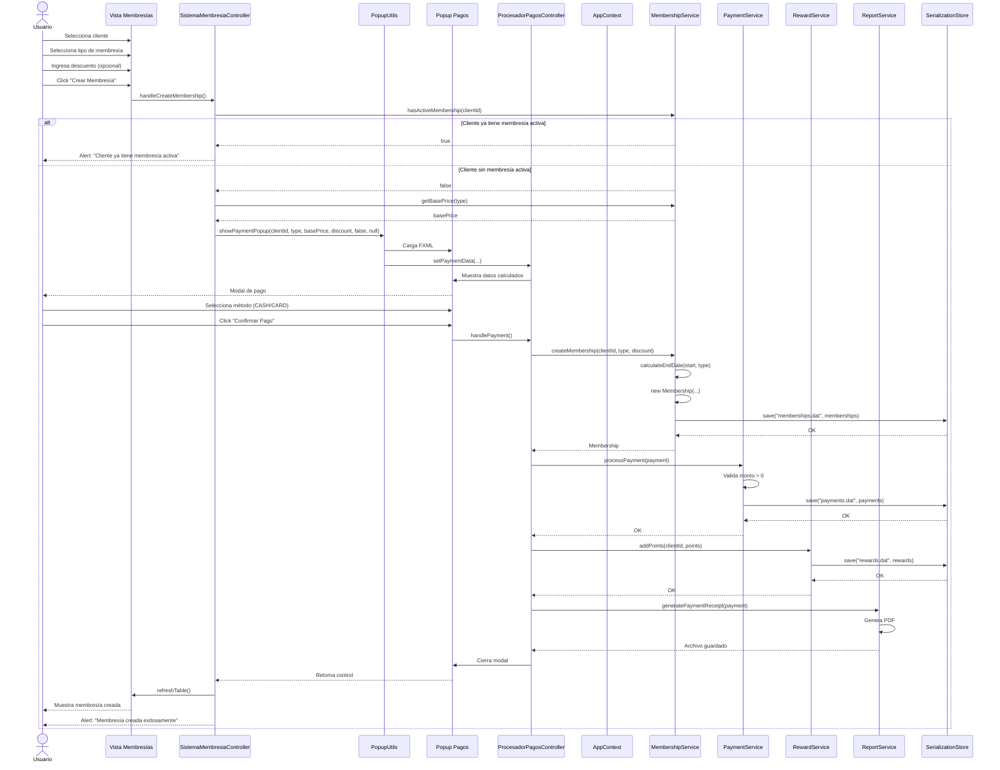
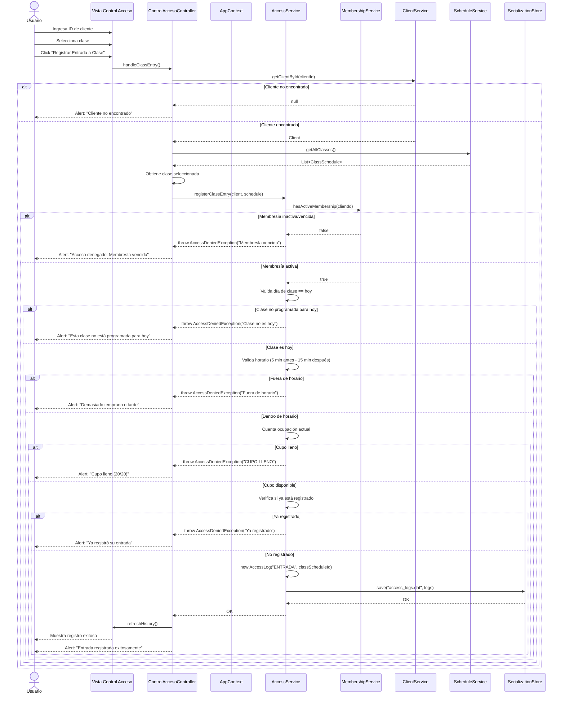
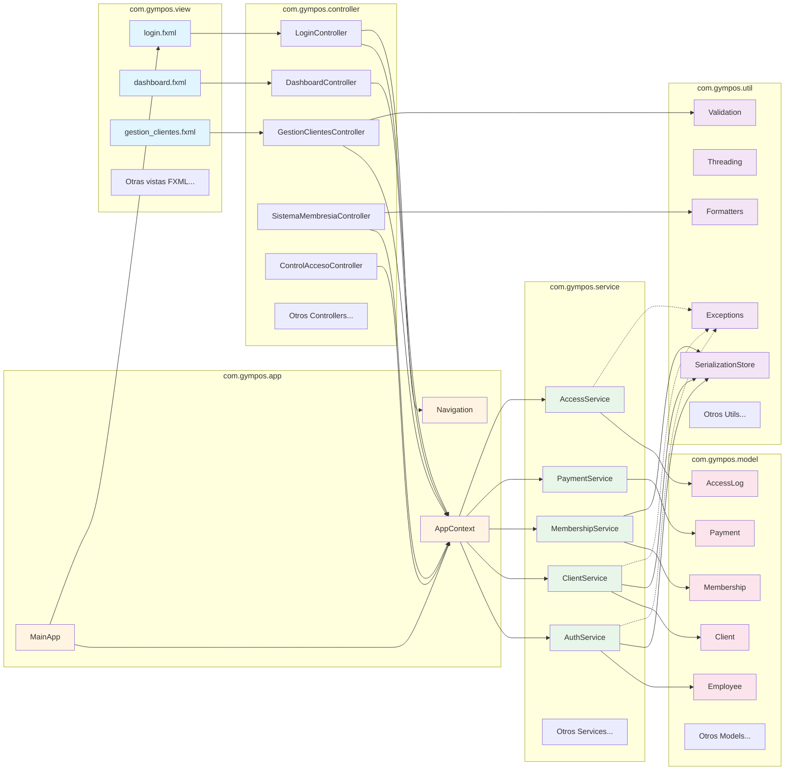
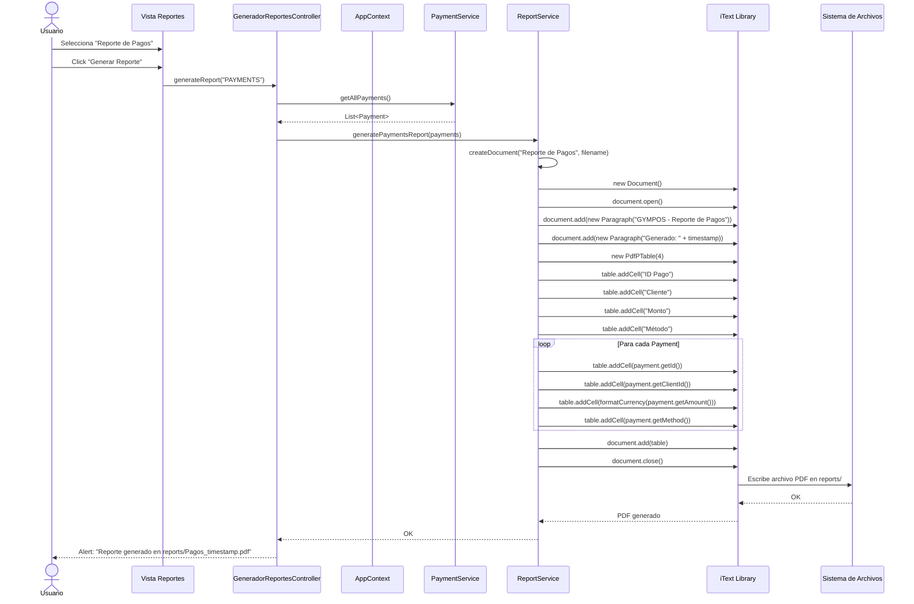

# Diagramas UML del Sistema GymPOS

## 1. Diagrama de Clases Completo del Sistema

```mermaid
classDiagram
    %% ============ CAPA APP ============
    class MainApp {
        +start(Stage) void
        +stop() void
        +main(String[]) void
    }
    
    class AppContext {
        +Employee activeUser
        +AuthService authService
        +ClientService clientService
        +MembershipService membershipService
        +PaymentService paymentService
        +ReportService reportService
        +AccessService accessService
        +InventoryService inventoryService
        +ScheduleService scheduleService
        +BackupService backupService
        +RewardService rewardService
        +init() void
        +shutdown() void
    }
    
    class Navigation {
        +load(String) Parent
    }

    %% ============ CAPA MODEL ============
    class Client {
        -String id
        -String fullName
        -String email
        -String phone
        -boolean active
        -LocalDate createdAt
        +getId() String
        +getFullName() String
        +getEmail() String
        +getPhone() String
        +isActive() boolean
        +setActive(boolean) void
        +getStatusString() String
    }
    
    class Employee {
        -String id
        -String name
        -String username
        -String passwordHash
        +getId() String
        +getName() String
        +getUsername() String
        +getPasswordHash() String
        +setPasswordHash(String) void
    }
    
    class Membership {
        <<enumeration>> Type
        -String clientId
        -Type type
        -LocalDate start
        -LocalDate end
        -double pricePaid
        -double discountApplied
        +getClientId() String
        +getType() Type
        +getStart() LocalDate
        +getEnd() LocalDate
        +setEnd(LocalDate) void
    }
    
    class MembershipType {
        <<enumeration>>
        BASIC
        STANDARD
        PREMIUM
        ANUAL
    }
    
    class Payment {
        -String id
        -String clientId
        -double amount
        -LocalDateTime timestamp
        -String method
        +getId() String
        +getClientId() String
        +getAmount() double
        +getTimestamp() LocalDateTime
        +getMethod() String
    }
    
    class AccessLog {
        -String clientId
        -String classScheduleId
        -LocalDateTime timestamp
        -String action
        +getClientId() String
        +getTimestamp() LocalDateTime
        +getAction() String
        +getClassScheduleId() String
    }
    
    class ClassSchedule {
        -String id
        -String className
        -DayOfWeek day
        -LocalTime time
        -int duration
        -int capacity
        +getId() String
        +getClassName() String
        +getDay() DayOfWeek
        +getTime() LocalTime
        +getDuration() int
        +getCapacity() int
        +getEndTime() LocalTime
        +getTimeRange() String
    }
    
    class InventoryItem {
        -String id
        -String name
        -int quantity
        -String location
        +getId() String
        +getName() String
        +getQuantity() int
        +getLocation() String
        +setQuantity(int) void
    }
    
    class RewardPoint {
        -String clientId
        -int points
        +getClientId() String
        +getPoints() int
        +add(int) void
        +redeem(int) void
    }

    %% ============ CAPA SERVICE ============
    class AuthService {
        -List~Employee~ employees
        +login(String, String) Employee
        +addEmployee(Employee) void
        +updateEmployee(Employee) void
        +removeEmployee(String) void
        +getEmployeeById(String) Optional~Employee~
        +getAllEmployees() List~Employee~
        +hashPassword(String) String
    }
    
    class ClientService {
        -List~Client~ clients
        +addClient(Client) void
        +updateClient(Client) void
        +removeClient(String) void
        +getClientById(String) Client
        +getAllClients() List~Client~
        +getActiveClients() List~Client~
        +generateNextId() String
        +deactivateClient(String) void
    }
    
    class MembershipService {
        -List~Membership~ memberships
        +createMembership(String, Type, double) Membership
        +renewMembership(String, Type, double) void
        +cancelMembership(String) void
        +hasActiveMembership(String) boolean
        +getCurrentMembership(String) Membership
        +getExpiringMemberships(int) List~Membership~
        +calculateEndDate(LocalDate, Type) LocalDate
        +getBasePrice(Type) double
        +scheduleExpiringNotifications() void
    }
    
    class PaymentService {
        -List~Payment~ payments
        +processPayment(Payment) void
        +getAllPayments() List~Payment~
    }
    
    class AccessService {
        -List~AccessLog~ accessLogs
        +registerEntry(Client) void
        +registerExit(Client) void
        +registerClassEntry(Client, ClassSchedule) void
        +isClientInside(String) boolean
        +getClientAccessHistory(String) List~AccessLog~
        +getAllAccessLogs() List~AccessLog~
    }
    
    class InventoryService {
        -List~InventoryItem~ items
        +addItem(InventoryItem) void
        +updateItem(InventoryItem) void
        +removeItem(String) void
        +getItemById(String) InventoryItem
        +getAllItems() List~InventoryItem~
    }
    
    class ScheduleService {
        -List~ClassSchedule~ schedules
        +addClass(ClassSchedule) void
        +updateClass(ClassSchedule) void
        +removeClass(String) void
        +getAllClasses() List~ClassSchedule~
    }
    
    class BackupService {
        +manualBackup() void
        +scheduleNightlyBackup() void
    }
    
    class ReportService {
        +generatePaymentsReport(List~Payment~) void
        +generateClientsReport(List~Client~) void
        +generateMembershipsReport(List~Membership~) void
        +generateAccessReport(List~AccessLog~) void
        +generateInventoryReport(List~InventoryItem~) void
        +generateScheduleReport(List~ClassSchedule~) void
        +generateBackupsReport(List~String~) void
    }
    
    class RewardService {
        -List~RewardPoint~ rewards
        +getPoints(String) RewardPoint
        +addPoints(String, int) void
        +redeemPoints(String, int) void
    }

    %% ============ CAPA CONTROLLER ============
    class LoginController {
        -TextField usernameField
        -PasswordField passwordField
        -Label errorLabel
        +onLogin(ActionEvent) void
    }
    
    class DashboardController {
        -BorderPane root
        -Label timeLabel
        -Label dateLabel
        +goToGestionClientes() void
        +goToSistemaMembresias() void
        +goToControlAcceso() void
        +goToGeneradorReportes() void
        +goToProcesadorPagos() void
        +goToInventario() void
        +goToGestionEmpleados() void
        +goToCalendario() void
        +handleManualBackup() void
        +handleLogout() void
    }
    
    class GestionClientesController {
        +handleAdd() void
        +handleEdit() void
        +handleDelete() void
        +refreshTable() void
    }
    
    class SistemaMembresiaController {
        +handleCreateMembership() void
        +handleRenewMembership() void
        +handleCancelMembership() void
    }
    
    class ControlAccesoController {
        +handleEntry() void
        +handleExit() void
        +handleClassEntry() void
    }
    
    class ProcesadorPagosController {
        +setPaymentData(...) void
        +handlePayment() void
    }
    
    class InventarioController {
        +handleAdd() void
        +handleUpdate() void
        +handleRemove() void
    }
    
    class SchedulesController {
        +handleAddClass() void
        +handleUpdateClass() void
        +handleRemoveClass() void
    }
    
    class GestionEmpleadosController {
        +handleAddEmployee() void
        +handleUpdateEmployee() void
        +handleRemoveEmployee() void
    }
    
    class GeneradorReportesController {
        +generateReport(String) void
    }

    %% ============ CAPA UTIL ============
    class SerializationStore {
        -String basePath
        +initBasePaths(String) void
        +save(String, Object) void
        +load(String) T
    }
    
    class Threading {
        -ExecutorService executor
        +init() void
        +shutdown() void
        +submitTask(Runnable) void
    }
    
    class Validation {
        +isNullOrEmpty(String) boolean
        +isValidEmail(String) boolean
        +isPositive(double) boolean
    }
    
    class Formatters {
        +formatCurrency(double) String
        +formatDate(LocalDate) String
    }
    
    class PopupUtils {
        +showPaymentPopup(...) ProcesadorPagosController
    }
    
    class DataSeeder {
        +seed() void
    }
    
    class Exceptions {
        <<interface>>
    }
    
    class AccessDeniedException {
        +AccessDeniedException(String)
    }
    
    class AuthenticationException {
        +AuthenticationException(String)
    }
    
    class MembershipException {
        +MembershipException(String)
    }
    
    class PaymentException {
        +PaymentException(String)
    }
    
    class ValidationException {
        +ValidationException(String)
    }

    %% ============ RELACIONES ============
    
    %% App con Services
    AppContext --> AuthService
    AppContext --> ClientService
    AppContext --> MembershipService
    AppContext --> PaymentService
    AppContext --> ReportService
    AppContext --> AccessService
    AppContext --> InventoryService
    AppContext --> ScheduleService
    AppContext --> BackupService
    AppContext --> RewardService
    AppContext --> Employee
    
    MainApp --> AppContext
    MainApp --> DataSeeder
    
    %% Services con Models
    AuthService --> Employee
    ClientService --> Client
    MembershipService --> Membership
    PaymentService --> Payment
    AccessService --> AccessLog
    AccessService --> Client
    AccessService --> ClassSchedule
    InventoryService --> InventoryItem
    ScheduleService --> ClassSchedule
    RewardService --> RewardPoint
    
    %% Services con Utils
    AuthService --> SerializationStore
    ClientService --> SerializationStore
    MembershipService --> SerializationStore
    MembershipService --> Threading
    PaymentService --> SerializationStore
    AccessService --> SerializationStore
    InventoryService --> SerializationStore
    ScheduleService --> SerializationStore
    RewardService --> SerializationStore
    
    ReportService --> Payment
    ReportService --> Client
    ReportService --> Membership
    ReportService --> AccessLog
    ReportService --> InventoryItem
    ReportService --> ClassSchedule
    
    %% Controllers con Services
    LoginController --> AppContext
    LoginController --> Navigation
    DashboardController --> AppContext
    DashboardController --> Navigation
    GestionClientesController --> AppContext
    SistemaMembresiaController --> AppContext
    ControlAccesoController --> AppContext
    ProcesadorPagosController --> AppContext
    InventarioController --> AppContext
    SchedulesController --> AppContext
    GestionEmpleadosController --> AppContext
    GeneradorReportesController --> AppContext
    
    %% Controllers con Utils
    GestionClientesController --> Validation
    SistemaMembresiaController --> PopupUtils
    
    %% Model relationships
    Membership --> MembershipType
    Client "1" -- "0..*" Membership
    Client "1" -- "0..*" Payment
    Client "1" -- "0..*" AccessLog
    Client "1" -- "0..1" RewardPoint
    ClassSchedule "1" -- "0..*" AccessLog
    
    %% Exceptions
    Exceptions <|-- AccessDeniedException
    Exceptions <|-- AuthenticationException
    Exceptions <|-- MembershipException
    Exceptions <|-- PaymentException
    Exceptions <|-- ValidationException
```



## 2. Diagrama de Secuencia: Proceso de Login



## 3. Diagrama de Secuencia: Creación de Membresía con Pago



## 4. Diagrama de Secuencia: Control de Acceso a Clase



## 5. Diagrama de Arquitectura General del Sistema

```mermaid
graph TB
    subgraph "Capa de Presentación"
        A[JavaFX Views FXML]
        B[Controllers]
    end
    
    subgraph "Capa de Aplicación"
        C[MainApp]
        D[AppContext]
        E[Navigation]
    end
    
    subgraph "Capa de Lógica de Negocio"
        F[AuthService]
        G[ClientService]
        H[MembershipService]
        I[PaymentService]
        J[AccessService]
        K[InventoryService]
        L[ScheduleService]
        M[BackupService]
        N[ReportService]
        O[RewardService]
    end
    
    subgraph "Capa de Dominio"
        P[Employee]
        Q[Client]
        R[Membership]
        S[Payment]
        T[AccessLog]
        U[ClassSchedule]
        V[InventoryItem]
        W[RewardPoint]
    end
    
    subgraph "Capa de Infraestructura"
        X[SerializationStore]
        Y[Threading]
        Z[Validation]
        AA[Formatters]
        AB[PopupUtils]
        AC[Exceptions]
    end
    
    subgraph "Persistencia"
        AD[(Archivos .dat)]
    end
    
    subgraph "Generación de Reportes"
        AE[iText PDF Library]
        AF[/Reportes PDF/]
    end
    
    A --> B
    B --> D
    B --> E
    B --> Z
    B --> AA
    B --> AB
    
    C --> D
    D --> F
    D --> G
    D --> H
    D --> I
    D --> J
    D --> K
    D --> L
    D --> M
    D --> N
    D --> O
    
    F --> P
    G --> Q
    H --> R
    I --> S
    J --> T
    J --> U
    K --> V
    O --> W
    
    F --> X
    G --> X
    H --> X
    I --> X
    J --> X
    K --> X
    L --> X
    O --> X
    
    H --> Y
    M --> Y
    
    X --> AD
    
    N --> AE
    AE --> AF
    
    F -.throw.-> AC
    G -.throw.-> AC
    H -.throw.-> AC
    I -.throw.-> AC
    J -.throw.-> AC
    
    style A fill:#e1f5ff
    style B fill:#e1f5ff
    style C fill:#fff4e1
    style D fill:#fff4e1
    style E fill:#fff4e1
    style F fill:#e8f5e9
    style G fill:#e8f5e9
    style H fill:#e8f5e9
    style I fill:#e8f5e9
    style J fill:#e8f5e9
    style K fill:#e8f5e9
    style L fill:#e8f5e9
    style M fill:#e8f5e9
    style N fill:#e8f5e9
    style O fill:#e8f5e9
    style P fill:#fce4ec
    style Q fill:#fce4ec
    style R fill:#fce4ec
    style S fill:#fce4ec
    style T fill:#fce4ec
    style U fill:#fce4ec
    style V fill:#fce4ec
    style W fill:#fce4ec
    style X fill:#f3e5f5
    style Y fill:#f3e5f5
    style Z fill:#f3e5f5
    style AA fill:#f3e5f5
    style AB fill:#f3e5f5
    style AC fill:#f3e5f5
    style AD fill:#ffe0b2
    style AE fill:#e0f2f1
    style AF fill:#e0f2f1
```



## 6. Diagrama de Componentes: Estructura de Módulos



## 7. Diagrama de Secuencia: Generación de Reporte PDF



## Descripción de la Arquitectura

### Patrón Arquitectónico
El sistema GymPOS implementa una **arquitectura en capas** con separación clara de responsabilidades:

1. **Capa de Presentación**: Vistas FXML y Controllers JavaFX
2. **Capa de Aplicación**: Punto de entrada y coordinación global (MainApp, AppContext)
3. **Capa de Lógica de Negocio**: Services que encapsulan reglas de negocio
4. **Capa de Dominio**: Entidades del modelo de datos
5. **Capa de Infraestructura**: Utilidades transversales y persistencia

### Principios Aplicados
- **Separation of Concerns**: Cada capa tiene responsabilidades específicas
- **Dependency Injection**: AppContext actúa como contenedor de servicios
- **Single Responsibility**: Cada clase tiene un propósito único
- **Data Transfer**: Modelos como DTOs entre capas
- **Facade Pattern**: AppContext simplifica acceso a servicios
- **Observer Pattern**: JavaFX properties para binding de UI
- **Template Method**: Controllers siguen flujo estándar de validación-servicio-actualización

### Flujo de Datos
```
Usuario → Vista FXML → Controller → Service → Model → SerializationStore → Archivo .dat
```

### Características Técnicas
- **Persistencia**: Serialización Java (archivos .dat)
- **Concurrencia**: ExecutorService para tareas background
- **Reportes**: iText para generación de PDFs
- **UI**: JavaFX con FXML + CSS
- **Validación**: Centralizada en capa de servicios
- **Excepciones**: Jerarquía personalizada para errores de negocio
